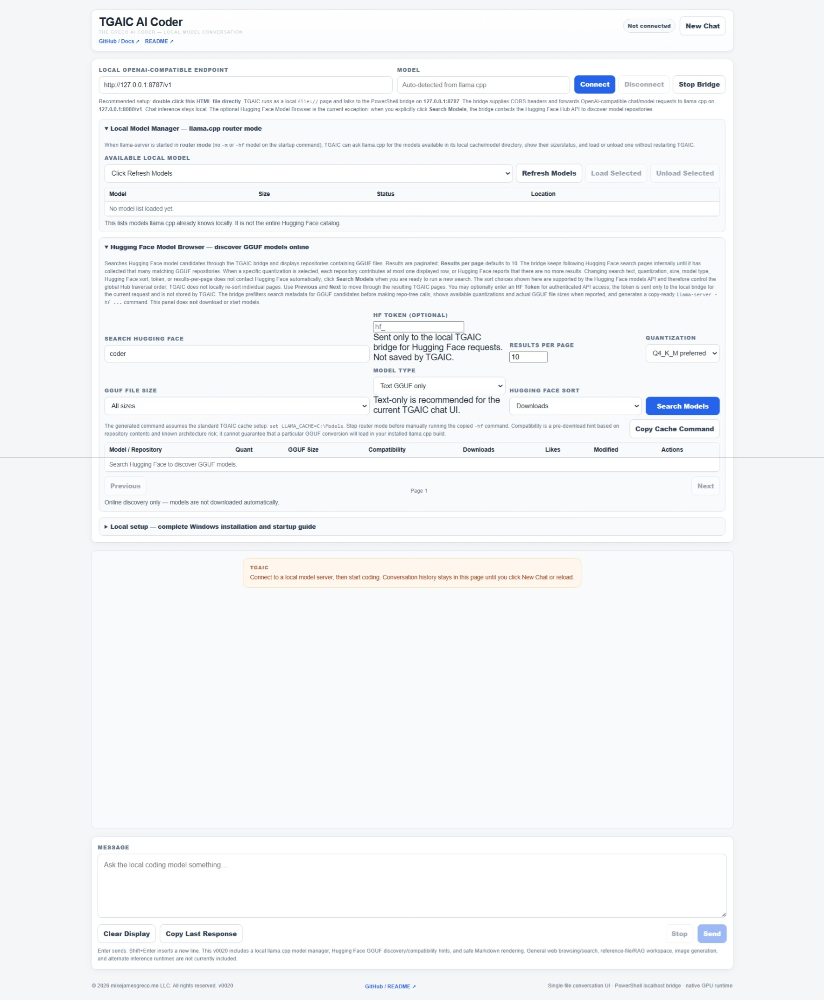

# TGAIC AI Coder

**The Greco AI Coder**

A lightweight, local-first AI coding assistant with a single-file browser UI, a small localhost bridge, llama.cpp integration, and built-in Hugging Face GGUF model discovery.

TGAIC keeps the user interface simple and portable while running inference on local hardware through `llama-server`.

> **Your model is local. Your code stays under your control.**



## Run TGAIC

TGAIC is a local application. The browser UI is a standalone HTML file, but the full runtime also uses the included PowerShell bridge and llama.cpp.

> **Download `tgaic-ai-coder.html` and run it locally.** The GitHub Pages copy is useful for viewing the project, but the supported TGAIC runtime is the downloaded/local HTML file opened directly from disk.

Like TGRCL, TGAIC talks from the browser to a local plain-HTTP bridge. A page opened from `https://mikejamesgreco.github.io/` may be prevented by the browser from calling `http://127.0.0.1:8787` because of mixed-content, private-network, or enterprise browser security rules. Opening the downloaded HTML as a local `file://` page avoids that hosted HTTPS-to-local HTTP boundary in the normal TGAIC workflow.

```text
TGAIC HTML (file://)
        │
        ▼
PowerShell Bridge
127.0.0.1:8787
        │
        ▼
llama-server / llama.cpp
127.0.0.1:8080
        │
        ▼
Local GGUF model cache
C:\Models
```

The browser owns the UI and conversation history. The bridge provides the browser-safe localhost/CORS boundary plus model-management and Hugging Face helper endpoints. `llama-server` performs model loading and inference.

The GitHub Pages site is the public project/documentation entry point. For normal local inference, **download or clone the repository**, start llama.cpp and the bridge, then open the downloaded `tgaic-ai-coder.html` directly from disk.

---

## Why TGAIC?

Many AI coding tools require cloud accounts, remote inference, subscriptions, or large development stacks.

TGAIC takes a different approach:

- **Local-first inference** — chat runs against models on your own machine.
- **Single-file browser UI** — the main application UI is one HTML file.
- **Small local bridge** — PowerShell supplies the localhost/CORS and helper layer.
- **llama.cpp native runtime** — no browser-embedded model runtime is required.
- **GGUF-first model workflow** — use quantized models from the Hugging Face ecosystem.
- **No JavaScript framework/CDN dependency** — the UI remains self-contained.
- **Manual model control** — discovery, cache, load, unload, and router mode remain visible and understandable.
- **Progressive capability** — small models work on modest hardware, while the same UI can scale to much larger local machines.

---

## Getting Started

### 1. Install llama.cpp

```bat
winget install llama.cpp
```

Verify it is available:

```bat
llama-server --version
where llama-server
```

### 2. Establish the local model cache

```bat
set LLAMA_CACHE=C:\Models
```

### 3. Download/cache a GGUF model

For example:

```bat
llama-server -hf Qwen/Qwen2.5-Coder-3B-Instruct-GGUF:Q4_K_M
```

Wait for the download and load attempt to complete, then stop it with `Ctrl+C`.

### 4. Start llama.cpp in generic router mode

```bat
set LLAMA_CACHE=C:\Models
llama-server --host 127.0.0.1 --port 8080 -c 8192
```

Router mode intentionally has no `-hf` or `-m` argument.

### 5. Start the TGAIC bridge

```bat
powershell.exe -NoProfile -ExecutionPolicy Bypass -File .\tgaic-ai-coder-bridge-v0025.ps1
```

Expected endpoints:

```text
Bridge:       http://127.0.0.1:8787/
llama-server: http://127.0.0.1:8080/
TGAIC API:    http://127.0.0.1:8787/v1
```

### 6. Download and open the browser UI locally

Download or clone the repository so you have a local copy of:

```text
tgaic-ai-coder.html
```

Then double-click that local file. The supported runtime is the local `file://` page, not the GitHub Pages-hosted copy.

Leave the endpoint at:

```text
http://127.0.0.1:8787/v1
```

Then click **Connect**, **Refresh Models**, and **Load Selected** as needed.

---

## Core Features

### Local Chat

TGAIC sends OpenAI-compatible chat requests through the local bridge to `llama-server`.

### Local Model Manager

The browser can refresh models known to llama.cpp, select cached models, load/unload models, and show the active model.

### Hugging Face Model Browser

TGAIC can search Hugging Face for GGUF repositories through the local bridge.

Current discovery capabilities include:

- Search by model/repository text
- Results-per-page pagination
- Hugging Face API-supported global sort choices
- Quantization filtering
- GGUF file-size filtering
- Text versus multimodal repository filtering
- `mmproj` companion detection
- MTP-sidecar detection
- Advisory compatibility hints
- Optional Hugging Face token authentication
- Generated `llama-server -hf ...` commands

Changing filters does not automatically contact Hugging Face. Click **Search Models** when ready.

### Markdown Responses

Assistant responses are rendered locally as safe Markdown, including headings, emphasis, lists, inline/fenced code, language labels, Copy buttons, blockquotes, links, horizontal rules, and basic Markdown tables.

Model-produced HTML is escaped rather than executed.

---

## Model Cache Workflow

```text
Discover model
      │
      ▼
set LLAMA_CACHE=C:\Models
      │
      ▼
llama-server -hf user/repository:quant
      │
      ▼
download + verify load
      │
      ▼
Ctrl+C
      │
      ▼
restart generic router mode
      │
      ▼
Refresh Models
      │
      ▼
Load Selected
      │
      ▼
Chat
```

A GGUF file does **not** need to fit entirely in GPU VRAM. llama.cpp can offload part of the workload to the GPU and use CPU/system RAM for the remainder.

In testing, a roughly **3.4 GB / 6B-class coder/reasoning GGUF** ran successfully on a machine with only **2 GB of GPU VRAM**.

GGUF file size is therefore a useful discovery signal, not a hard VRAM limit.

---

## Model Compatibility

A repository containing a `.gguf` file is not automatically guaranteed to load in the installed llama.cpp build.

TGAIC's compatibility column is advisory. It can identify traits such as:

- Text GGUF
- Multimodal repository with `mmproj`
- Optional MTP sidecar
- Newer model-family warnings

The definitive compatibility check is still whether the exact GGUF conversion successfully loads in the installed llama.cpp build.

On Windows, llama.cpp may print:

```text
failed to create symlink: A required privilege is not held by the client
switching to degraded mode
```

If loading continues afterward, that message by itself is not necessarily the fatal error. Read the later llama.cpp output for the actual load result.

---

## Hugging Face Token

An optional token can be entered in the HTML page or supplied to the bridge:

```bat
set HF_TOKEN=hf_your_token_here
```

The HTML token is sent only to the local bridge in the `X-HF-Token` header. TGAIC does not persist it in localStorage, sessionStorage, cookies, or files.

---

## Hosted Page and Browser Security

The repository can be published with GitHub Pages at:

**https://mikejamesgreco.github.io/tgaic-ai-coder/**

However, the hosted page uses HTTPS while the normal TGAIC bridge listens on plain HTTP at:

```text
http://127.0.0.1:8787
```

Modern browsers may restrict or block an HTTPS page from calling a local HTTP service because of mixed-content, private-network-access, or enterprise security policies.

For that reason, the **downloaded standalone `tgaic-ai-coder.html` file is the supported and most reliable way to run TGAIC**.

TGAIC does not attempt to bypass browser security policies.

---

## Local-First Architecture

Normal model conversation traffic remains on localhost:

```text
Browser UI
    │
    ▼
127.0.0.1:8787
    │
    ▼
127.0.0.1:8080
    │
    ▼
Local GGUF
```

The current intentional external-network exception is **Hugging Face model discovery**. When the user explicitly runs a model search, the bridge contacts the Hugging Face Hub API.

The local GGUF model itself does not inherently browse the web, scrape sites, or search the Internet.

General web search, arbitrary URL fetching, autonomous browsing, image generation, and reference-file/RAG tooling are future capabilities rather than current TGAIC features.

---

## TGAIC and the SFLA Pattern

TGAIC borrows the same local-first, minimal-infrastructure philosophy used by the SFLA projects, but there is an important distinction:

- `tgaic-ai-coder.html` is a **single-file browser UI**.
- The complete TGAIC runtime also requires the **PowerShell bridge** and **llama.cpp**.

So TGAIC is intentionally local-first and dependency-light, but it is not a pure browser-only Single-File Local Application in the same sense as TGG Grid.

---

## Repository Structure

```text
tgaic-ai-coder/
│
├── index.html                         # GitHub Pages launcher → tgaic-ai-coder.html
├── tgaic-ai-coder.html               # Stable/versionless browser UI
├── tgaic-ai-coder-bridge-v0025.ps1   # Local bridge
├── screenshot.jpeg                    # Repository preview
├── README.md
├── .gitignore
├── CHANGELOG.md
└── LICENSE
```

Versioned HTML working copies such as `tgaic-ai-coder-v0021.html` can be retained during development or releases, while `tgaic-ai-coder.html` remains the stable repository entry point.

---

## Browser Support

TGAIC is designed for modern desktop browsers.

The primary tested workflow is Microsoft Edge/Chrome on Windows with the **downloaded HTML opened directly as a local `file://` page**. If the GitHub Pages copy cannot reach the local bridge, use the downloaded standalone HTML file.

---

## Privacy

Normal chat inference uses the selected local GGUF model through localhost.

Users should still consider browser extensions, operating-system policies, network policies, code pasted into prompts, Hugging Face searches they explicitly run, and tokens or credentials they choose to enter when working with sensitive information.

---

## Project Status

TGAIC is under active development.

The project began as a small local coding chat UI and has expanded into a local model manager and Hugging Face GGUF discovery workspace.

---

## Philosophy

```text
No cloud model required.
No JavaScript framework.
No CDN dependency.
No hidden model runtime.

Just a browser UI, a small local bridge,
llama.cpp, and your GGUF models.
```

---

## License

License information will be added to the repository's `LICENSE` file.

---

## Author

**Michael J. Greco**

TGAIC — **The Greco AI Coder**

© mikejamesgreco.me LLC. All rights reserved.
